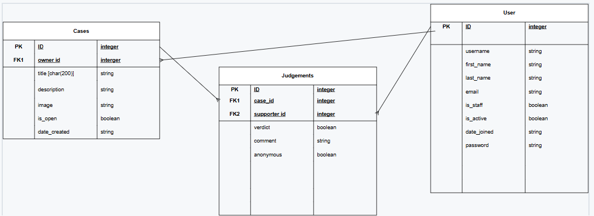
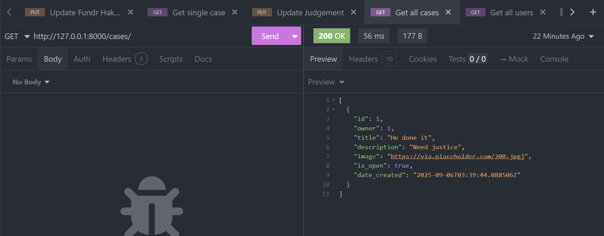
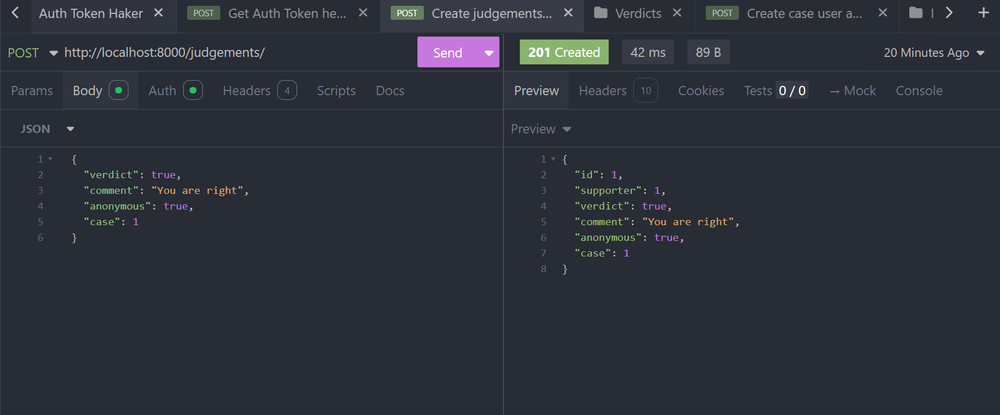
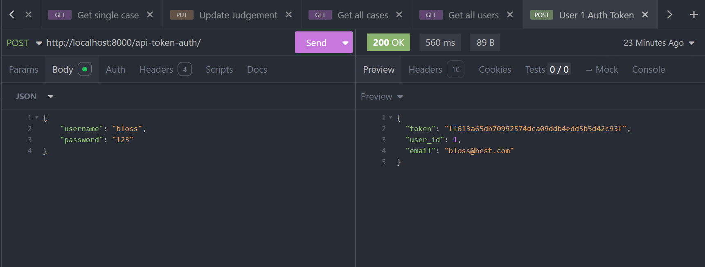

# Crowdfunding Back End
Raise the Case

## Planning:
### Concept/Name
A crowd-powered platform where the public helps “try” cases and mysteries in the court of public opinion. Users can review details of real cases and vote on who they believe is guilty.

### Intended Audience/User Stories
Users - Victims who feel the justice system has failed them or can't access it, or for crimes that are petty and would not be put before a jury. 
Audience - True crime enthusiast, civil-minded citizens, gamified social media users, social justice warriors, investigators and nosy people. 

### Front End Pages/Functionality
- Homepage
  - Featured cases (spotlighted by popularity, urgency, or recency).
  - Search bar + filters (by case type: murder, fraud, cold case, celebrity scandal, etc.).
  - Quick “Justice Now” button to jump into trending cases.

- Case Detail Page
  - Case summary: timeline, suspects, evidence (text, images, videos).
  - Voting options: “Guilty” / “Not Guilty” 
  - Voting stats displayed in real time (pie chart or percentages).
  - Comment/discussion section for arguments & theories.
  - “Related cases” sidebar to keep users engaged.

- Voting / Verdict Submission Page
  - Clean UI for making a vote quickly.
  - Confirmation + optional reasoning (short text or multiple-choice).
  - Social share option: “I just voted on Case X.”

- Leaderboards & Stats
  - Top users by accuracy (how often their vote aligned with majority or real verdicts).
  - “Detective Rank” gamification system (levels, badges, streaks).
  - Case outcomes archive showing how the public voted vs. official outcome.

### API Spec
{{ Fill out the table below to define your endpoints. An example of what this might look like is shown at the bottom of the page. 

It might look messy here in the PDF, but once it's rendered it looks very neat! 

It can be helpful to keep the markdown preview open in VS Code so that you can see what you're typing more easily. }}

| URL             | HTTP Method               | Purpose | Request Body                  | Success Response Code | Authentication/Authorisation |
| --------------- | ------------------------- | ------- | ----------------------------- | --------------------- | ---------------------------- |
| /users/   | POST | Create a new user     | `{"username": "investigator", "password": "123"}`  | 201                   | api-token-auth/                         |
| /api-token-auth/    | POST | Get auth token    | `{"username": "investigator", "password": "123"}`  | 200                   | bearer                        |
| /cases/    | POST     | Create new case     | JSON Payload                  | 201                   | Any logged in user           |
| /cases/1/ |                           |         |                               |                       |                              |
| /cases    |                           | GET     | N/A                           | 200                   |                              |
| /cases    | Create new judgement        | POST    | {"case_id} JSON Payload | 201                   | Any logged in user           |
### DB Schema

!!!!Future developments, only let people judge once